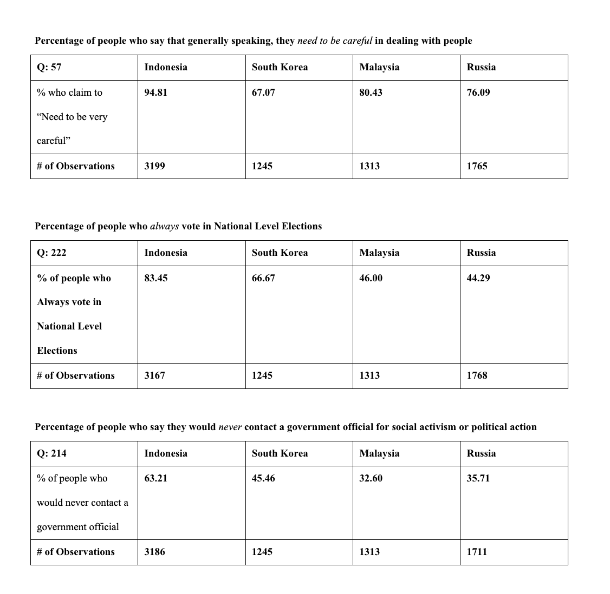

The Designed Tables were used for analysis of international data from Indonesia, Malaysia, Russia, and South Korea based on data code used in STATA. 
The purpose of these tables to view potential correlations between countries and used in the Data Analysis Report. 

The Data Analysis Report shows all STATA code used to analyze key similiarities and differences between Indonesia, Malaysia, Russia, and South Korea. 

The Analytical Research Paper compares the correlations and findings between Indonesia, Malaysia, Russia, and South Korea based on forms of governance, 
qualitative research, international nonprofits, and scholars. This Research Paper was based on STATA data derived from the Data Analysis Report to be compared with expert scholars to 
form independent conclusions of potential correlations between the 4 countries. 

This research was completed as part of a Political Science Course at Grinnell College titled, "Democratization and Politics of Regime Change."

<h1 align="center">
  <picture>
    <source media="(prefers-color-scheme: dark)" />
    
  </picture>

</h1>
